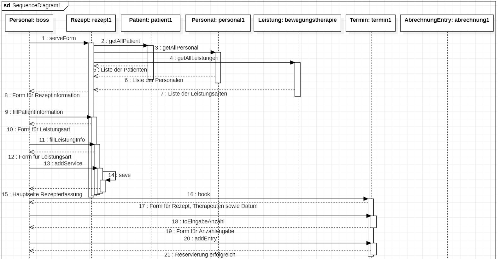
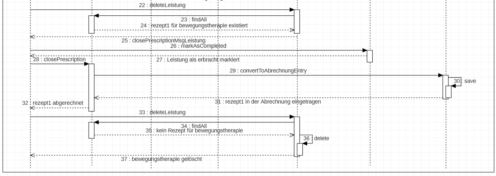

[options="header"]
[cols="1, 3, 3"]
|===
|Version | Bearbeitungsdatum   | Autor 
|0.1	| 09.04.2023 | Haufe
|0.2	|03.05.2023  | Watanabe
|1.0	|10.05.2023  | Haufe +
Khleif +
Tejani +
Watanabe
|1.1    |17.06.2023| Watanabe
|===

= Entwicklerdokumentation

== Einführung und Ziele
* Aufgabenstellung

In einer Physiotherapeutischen Praxis werden physiotherapeutische Leistungen wie Massagen, Elektro-Therapie, Krankengymnastik sowie andere Therapien angeboten. Alle Leistungen sind in einem Katalog mit festen Preisen aufgelistet.

Die Abrechnung der Leistungen erfolgt normalerweise gegen Rezept des Arztes. Dabei haben die Patienten der gesetzlichen Krankenkassen pro Rezept 10 EUR Rezeptgebühr plus einen Eigenanteil von 10% des Preises der erhaltenen Leistung zu zahlen. Der Restbetrag wird mit der jeweiligen Krankenkasse des Patienten abgerechnet. Dazu muss für jede Krankenkasse am Ende eines Monats eine Datei mit folgenden Informationen erstellt werden: persönliche Daten des Patienten (Name, Vorname, Geburtsdatum, Adresse), Zulassungsnummer des Arztes, Verschlüsselte Diagnosenummer, Bundesland, Personenkreis-Zugehörigkeit (Mitglied/Familienangehöriger/Rentner), physiotherapeutische Leistung (Anzahl der Behandlungen, Leistungsart).

Die eingenommenen Rezeptgebühren werden quartalsweise an die Krankenkassen abgeführt.

Neben der Erfassung der erbrachten Leistungen soll die Software die Vergabe von Terminen erleichtern, indem freie Termine ermittelt und vorgeschlagen werden. Terminwünsche der Patienten sind dabei jedoch ebenso zu berücksichtigen. Behandlungstermine werden in einem 20-Minuten-Raster vergeben, je nach tatsächlicher Dauer einer Leistung werden u.U. mehrere Zeiteinheiten benötigt. Zu beachten ist außerdem, dass ein Patient pro Rezept mehrere Leistungen erhalten kann, was entsprechend mehr Zeit für eine Behandlung erfordert.

Von der Software wird zusätzlich Unterstützung bei der Verwaltung einer Physiotherapie erwartet. Hierunter zählen vor allem die Personalverwaltung, die Abrechnung physiotherapeutischer Leistungen incl. täglicher/monatlicher Umsatzermittlung, die Abrechnung mit den Krankenkassen und das Editieren des Leistungskatalogs.

Eine Physiotherapie hält für ihre Patienten, wenn auch in geringem Umfang, ein Hilfs- und Heilmittelsortiment bereit. Dessen Verkauf sowie die Abrechnung von erbrachten Leistungen ohne Rezept soll zukünftig ebenfalls über die neue Software abgewickelt werden können.

* Qualitätsziele

1 = unrelevant ..
5 = relevant
[options="header", cols="3h, ^1, ^1, ^1, ^1, ^1"]
|===
|Qualitätsanforderung | 1 | 2 | 3 | 4 | 5
|Wartbarkeit          |   |   |   | x |
|Benutzbarkeit        |   |   | x |   |
|Sicherheit           |   |   |   | x |
|===

== Randbedingungen
=== Hardware-Vorgaben

Die Auflistung notwendiger Hardwaren für die Anwendung +

* Server
* Minimal-Server-Anforderung: 1 CPU Kern, 2GB RAM, 20GB Speicher
* Empfohlene-Server-Anforderung: 2 CPU Kerne, 4GB RAM, 40 GB Speicher
* Computer oder Smartphone zur Nutzung des Systems

=== Software-Vorgaben

Als Laufzeit wird Java 17 oder eine höhere Version benötigt. 

Die Anwendung ist für den Browser Firefox optimiert und benötigt eine Version 4.0 oder höher.

=== Vorgaben zum Betrieb des Software

Im Rahmen des Betriebsalltags einer physiotherapeutischen Einrichtungen, fallen die unterschiedlichsten
Aufgaben an. Das zu entwickelnde System soll dem Personal einer solchen Einrichtung bei der Ausführung
einiger ausgewählter Aufgaben unterstützen.

Vor allem Prozesse, welche ersatzweise noch schriftliche Dokumente in Papierform benötigen würden sollen ersetzt werden.
Dazu zählen u.a. die Personalverwaltung, die Leistungsabrechungen, die Terminplanung und das Verkaufsmanagement von einschlägigen
medizinischen Produkten innerhalb der Einrichtung.

Das System soll als Webanwendung über Computer und Smartphones innerhalb des Einrichtungsnetzwerkes durch
die Mitarbeiter genutzt werden können. Das System soll mangels vorhandenes IT-Personals eine hohe Robustheit und geringen Wartungsaufwand anstreben.
Die daraus resultierende reduzierte Komplexität ist in Kauf zu nehmen.

Das Einrichtungspersonal benutzt aktuell FireFox (aktuellste Version) als Browser. Daher wird das System für diesen Browser optimiert und auf diesem getestet.

== Lösungsstrategie
=== Erfüllung der Qualitätsziele
[options="header"]
|=== 
|Qualitätsziel |Lösung
|Wartbarkeit a|
* Softwarekomponenten sollen möglichst wenige Abhängigkeiten voneinander haben, um die Modularität zu erhöhen.
|Benutzbarkeit a|
* Das System sollte für jeden Nutzer intuitiv bedienbar sein. Dafür sollen im GUI aussagekräftige Labels für die Navigation verwendet werden, um Nutzer zur richtigen Aktion zu führen. 
* Sicherstellen, dass fehlerhafte Nutzereingaben nicht zu einem inkonsistenten Zustand des Systems führt. 
|Sicherheit a|
Sicherstellen, dass nur registrierte Nutzer sich ins System einloggen können.  Für diesen Zweck werden Spring Security und Thymeleaf  für Sicherheitsfunktionalität verwendet. 
|===

=== Softwarearchitektur

=== Entwurfsentscheidungen
* Verwendete Muster +
Spring MVC

* Persistenz +
H2
* Benutzeroberfläche +
Thymeleaf

//* Verwendung externer Frameworks +
//Salespoint-framework

== User-Interface

[options="header", cols="1,2"]
|===
|Externes Package |Verwendet von (Klasse der eigenen Anwendung)
|springframework.stereotype   |rezepterfassung.RezeptController +
                                rezepterfassung.RezeptInitializer +
                                terminplaner.TerminplanerController
|springframework.format|terminplaner.Termin
|springframework.core|rezepterfassung.RezeptInizializer, terminplaner.TerminInitializer
|springframework.http|terminplaner.TerminplanerController, rezepterfassung.RezeptController
|springframework.web|terminplaner.TerminplanerController, rezepterfassung.RezeptController
|springframework.data|rezepterfassung.RezeptRepository, terminplaner.TerminplanerRepository
|springframework.ui|rezepterfassung.RezeptController, terminplaner.TerminplanerController
|===

== Bausteinsicht
=== Entwurfsklassendiagramme der einzelnen Packages

[options="header"]
|=== 
|Klasse/Enumeration |Description
|Rezept|Eine Entity-Klasse, welche die Attribute für ein Rezept enthält und einem Patient und einer Personal zugeordnet wird.
|RezeptController|Eine Controller-Klasse für Rezept
|RezeptManagement|Eine Klasse, welche insbesondere die Behandlungen beim Löschen von referenzierten Entitäten bietet (z.B. beim Löschen von Patienten/Personal/Leistung, wenn ein Rezept existiert, welches auf diese verweist)
|RezeptRepository|Eine Interface, welche dem Controller CRUD-Operationen bietet
|LeistungInfo|Eine Klasse, welche einem Rezept eine Liste von Leistungsarten und ihrer Stückzahl zuordnet
|AbrechnungEntry|Eine Klasse, welche für jede LeistungInfo-Entität ihre Rezeptinformationen sowie ihre Status (Leistung erbracht, archiviert, Zahlung bestätigt) speichert
|===

[options="header"]
|===
|Klasse/Enumeration |Description
|Termin|Eine Entity-Klasse, welche die Attribute für einen Termin enthält
|TerminplanerController|Eine Controller-Klasse für Termin
|TerminRepository|Eine Interface, welche dem Controller CRUD-Operationen bietet
|TerminService|Eine Klasse, welche dem Controller Operationen für Kollisionserkennung sowie alternativen Terminvorschlag bietet
|===

[options="header"]
|=== 
|Klasse/Enumeration |Description
|Patient|Eine Entity-Klasse, die Attribute für ein Patient enthält.
|PatientController|Eine Controller-Klasse für Patienten.
|PatientService|Eine Interface mit operation für patienten ohne Body.
|PatientServiceImpl|Eine Klasse, die Interface PatientService implimentiert.
|PatientRepository|Eine Klasse, die dem Controller CRUD-Operationen bietet.
|===

[options="header"]
|=== 
|Klasse/Enumeration |Description
|Personal|Eine Entity-Klasse, die Attribute für ein Personal enthält.
|PersonalController|Eine Controller-Klasse für Personal.
|PersonalService|Eine Interface mit operation für Personal ohne Body.
|PersonalServiceImpl|Eine Klasse, die Interface PersonalService implimentiert.
|PersonalRepository|Eine Klasse, die dem Controller CRUD-Operationen bietet.
|===

[options="header"]
|===
|Klasse/Enumeration |Description
|Leistung|Eine Entity-Klasse, die Attribute für eine Leistung enthält.
|LeistungController|Eine Controller-Klasse für Leistungen.
|LeistungService|Eine Klasse mit operation für die Umsetzung Query und andere Methoden auf Leistung.
|LeistungDataInitializer| ist eine konkrete Implementierung des DataInitializer, die sich auf die Initialisierung von Leistungsdaten spezialisiert hat. Er enthält spezifische Logik und Methoden, die für die Initialisierung der Leistungsdaten relevant sind..
|DataInitializer|
Der DataInitializer ist eine Schnittstelle oder Klasse, die in einer Anwendung zur Initialisierung von Daten verwendet wird. Sie legt den grundlegenden Vertrag für die Dateninitialisierung fest, ohne spezifische Details zu enthalten..
|LeistungRepository|Eine Klasse, die dem Controller CRUD-Operationen bietet.
|===
=== Rückverfolgbarkeit zwischen Analyse- und Entwurfsmodell
[comment]
--
_Die folgende Tabelle zeigt die Rückverfolgbarkeit zwischen Entwurfs- und Analysemodell. Falls eine Klasse aus einem externen Framework im Entwurfsmodell eine Klasse des Analysemodells ersetzt,
wird die Art der Verwendung dieser externen Klasse in der Spalte *Art der Verwendung* mithilfe der folgenden Begriffe definiert:_

* Inheritance/Interface-Implementation
* Class Attribute
* Method Parameter
--
[options="header"]
|===
|Klasse/Enumeration (Analysemodell) |Klasse/Enumeration (Entwurfsmodell) |Art der Verwendung
| Personal |personalverwaltung.Personal|
| Personalverwaltung |personalverwaltung.PersonalManager, personalverwaltung.PersonalRepository,
CrudRepository| Inheritance
| Patient| patientverwaltung.Patient|
| Rezept |
rezepterfassung.Rezept,
rezepterfassung.LeistungInfo, rezepterfassung.AbrechnungEntry,
patientverwaltung.Patient, personalverwaltung.Personal |
| Rezepterfassung |
rezepterfassung.RezeptController,
rezepterfassung.RezeptRepository, rezepterfassung.RezeptManagement,
rezepterfassung.LeistungInfoRepository, rezepterfassung.AbrechnungEntryRepository,
CrudRepository| Inheritance
| Termin | terminplaner.Termin |
|Terminplaner|
terminplaner.TerminplanerController,
terminplaner.TerminplanerRepository, terminplaner.TerminService,
CrudRepository| Inheritance
|Leistung|leistungskatalog.Leistung |
|Leistungskatalog|
leistungskatalog.LeistungService,
leistungskatalog.KatalogleistungenController,
leistungskatalog.LeistungRepository, CrudRepository| Inheritance
|===

== Laufzeitsicht

== Testplan PhysGenie
Nach der Entwicklung der Prototypen beginnt die individuelle Testphase. Hierbei prüft jede/r Entwickler/in den eigenen Code sowie die damit implementierten Funktionen. Somit wird sichergestellt, dass bereits funktionsfähiger Code für den ersten Gesamtprototypen genutzt wird. Hierbei wird für die Prüfung JUNIT genutzt. Während der Testphase ist besonderes Augenmerk auf die Funktionen innerhalb des eigenen simulierten Systems zu legen.

Nach erfolgreichem Abschluss der Tests, werden die Prototypen kombiniert und bilden nun die Anwendung. Nach erfolgreicher Migration beginnt die primäre Testphase. Hierbei wird die Entwicklungsgruppe bzw. Individuen dieser das gesamte System prüfen, indem spezifische alltägliche Workflows nachgebildet werden. Beispiele hierfür sind: „Ein neuer Patient besucht die Praxis“ oder „Ein Patient kommt mit einem Rezept in die Praxis“. Diese Testphase soll eine Dauer von maximal 1,5 Wochen beanspruchen. Hierbei wird besonderes Augenmerk auf die Schnittstellenarbeit zwischen den einzelnen Prototypen, sowie auf den Test der reibungsfreien Integration dieser gelegt.

Da die Prototypen auf Basis der Muss-Anforderungen konzipiert wurden, wird im gleichen geprüft, inwieweit allen diesbezüglichen Anforderungen entsprochen wurde. Diese Testphase soll maximal eine Woche beanspruchen.

Nach Abschluss des Gesamtsystemtest, beginnt die Cross-Test-Phase. Hierbei wird das Projekt einem anderen Entwicklungsteam übergeben, welches das System in Hinblick auf die Anforderungen prüft. Hierbei wird besonderes Augenmerk auf die Einschätzung der Peer-Gruppe gelegt, inwieweit das System produktiv den Ansprüchen einer Physiotherapie (auf Basis der Anforderungen) entsprechen kann. Diese Testphase soll maximal 2 Wochen benötigen.

Sind alle Tests erfolgreich abgeschlossen, gilt die Testphase als erfolgreich beendet. Sollten Fehler oder Probleme aufgetaucht sind, wird das entsprechend Feedback verarbeitet und ggf. implementiert. In diesem Fall beginnt eine verkürzte Testphase, in dessen Fokus die neue/geänderte Funktion liegt.

== Technische Schulden
* Auflistung der nicht erreichten Quality Gates und der zugehörigen SonarQube Issues zum Zeitpunkt der Abgabe

