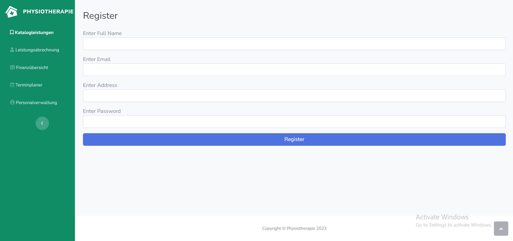

= Pflichtenheft
:project_name: Physiotherapie
== __{project_name}__

[options="header"]
[cols="1, 1, 1, 1, 4"]
|===
|Version | Status      | Bearbeitungsdatum   | Autoren(en) |  Vermerk
|0.1     | Abgeschlossen   | 13.04.2023          | Haufe +
Khleif +
Tejani +
Watanabe +
       | Initiale Version
|0.2     | Abgeschlossen   | 18.04.2023          | Haufe +
Khleif +
Tejani +
Watanabe +
      | Anpassungen an Anwendungsfällen

|1.0     | Abgeschlossen   | 24.04.2023          | Haufe +
Khleif +
Tejani +
Watanabe +
      | Anpassungen an Funktionale Anforderungen, Meilenstein OOA abgeschlossen
|===

== Inhaltsverzeichnis
Dieses Dokument benötigt ein Inhaltsverzeichnis. Es existieren mehrere Einbindungsmöglichkeiten.

== Zusammenfassung
Im Rahmen dieses Dokumentes werden die Anforderungen an ein System abstrahiert, welches im Rahmen der Verwaltung einer physiotherapeutischen Einrichtung einschlägig genutzt werden soll.
Hierbei werden eine Auswahl unterschiedlicher Aufgaben, welche in einer solchen Einrichtung anfallen können
zunächst erfasst und anschließend analysiert und dargestellt.

Diese Aufgaben erstrecken sich von Verwaltungs- bishin zu Planungs- und Abrechnungsfunktionen.

== Aufgabenstellung und Zielsetzung

Entwickeln Sie eine Software für den Betrieb einer Physiotherapie. Dabei seien zunächst nachfolgende Anforderungen bekannt.

In einer Physiotherapie werden physiotherapeutische Leistungen wie Massagen, Elektro-Therapie, Krankengymnastik u.a. angeboten. Alle Leistungen sind in einem Katalog mit festen Preisen aufgelistet.

Die Abrechnung der Leistungen erfolgt normalerweise gegen Rezept des Arztes. Dabei haben die Patienten der gesetzlichen Krankenkassen pro Rezept 10 EUR Rezeptgebühr plus einen Eigenanteil von 10% des Preises der erhaltenen Leistung zu zahlen. Der Restbetrag wird mit der jeweiligen Krankenkasse des Patienten abgerechnet. Dazu muss für jede Krankenkasse am Ende eines Monats eine Datei mit folgenden Informationen erstellt werden:
persönliche Daten des Patienten (Name, Vorname, Geburtsdatum, Adresse),
Zulassungsnummer des Arztes,
Verschlüsselte Diagnosenummer,
Bundesland,
Personenkreis-Zugehörigkeit (Mitglied/Familienangehöriger/Rentner),
physiotherapeutische Leistung (Anzahl der Behandlungen, Leistungsart).

Die eingenommenen Rezeptgebühren werden quartalsweise an die Krankenkassen abgeführt.

Neben der Erfassung der erbrachten Leistungen soll die Software die Vergabe von Terminen erleichtern, indem freie Termine ermittelt und vorgeschlagen werden. Terminwünsche der Patienten sind dabei jedoch ebenso zu berücksichtigen. Behandlungstermine werden in einem 20-Minuten-Raster vergeben, je nach tatsächlicher Dauer einer Leistung werden u.U. mehrere Zeiteinheiten benötigt. Zu beachten ist außerdem, dass ein Patient pro Rezept mehrere Leistungen erhalten kann, was entsprechend mehr Zeit für eine Behandlung erfordert.

Von der Software wird zusätzlich Unterstützung bei der Verwaltung einer Physiotherapie erwartet. Hierunter zählen vor allem die Personalverwaltung, die Abrechnung physiotherapeutischer Leistungen incl. täglicher/monatlicher Umsatzermittlung, die Abrechnung mit den Krankenkassen und das Editieren des Leistungskatalogs.

Eine Physiotherapie hält für ihre Patienten, wenn auch in geringem Umfang, ein Hilfs- und Heilmittelsortiment bereit. Dessen Verkauf sowie die Abrechnung von erbrachten Leistungen ohne Rezept soll zukünftig ebenfalls über die neue Software abgewickelt werden können.

== Produktnutzung
Im Rahmen des Betriebsalltags einer physiotherapeutischen Einrichtungen, fallen die unterschiedlichsten
Aufgaben an. Das zu entwickelnde System soll dem Personal einer solchen Einrichtung bei der Ausführung
einiger ausgewählter Aufgaben unterstützen.

Vorallem Prozesse, welche ersatzweise noch schriftliche Dokumente in Papierform benötigen würden sollen ersetzt werden.
Dazu zählen u.a. die Personalverwaltung, die Leistungsabrechungen, die Terminplanung und das Verkaufsmanagement von einschlägigen
medizinischen Produkten innerhalb der Einrichtung.

Das System soll als Webanwendung über Computer und Smartphones innerhalb des Einrichtungsnetzwerkes durch
die Mitarbeiter genutzt werden können. Das System soll mangels vorhandenes IT-Personals eine hohe Robustheit und geringen Wartungsaufwand anstreben.
Die daraus resultierende reduzierte Komplexität ist in Kauf zu nehmen.

Das Einrichtungspersonal benutzt aktuell FireFox (aktuellste Version) als Browser. Daher wird das System für diesen Browser optimiert und auf diesem getestet.

== Interessensgruppen (Stakeholder)

[options="header", cols="2, ^1, 4, 4"]
|===
|Name
|Priorität (1..4)
|Beschreibung
|Ziele / Vorstellungen

|Verwaltende Mitarbeiter der Einrichtung
|4
|Diese Mitarbeiter halten die Einrichtung am Laufen, regeln den Patientenkontakt und organisieren Prozesse für das physiotherapeutische Personal. Gleichzeitig kann physiotherapeutisches Personal das System nutzen, was dann jedoch als verwaltendes Personal abstrahiert werden kann.
a|
- Automatisierung von Prozessen
- Reduzierung von schriftlichen Dokumenten
- Verringerung des Verwaltungsaufwandes
- Optimierung des Einrichtungsbetriebes

-Erweiterbarkeit: Die Software sollte es ermöglichen, neue Funktionen und Erweiterungen leicht zu integrieren, um auf veränderte Anforderungen oder technologische Fortschritte reagieren zu können

|Administrator bzw. leitendes Personal
|3
|Personal, welches die Rahmenbedingungen des Einrichtungsalltags vorgeben kann, sowie Preise und Prozesse anpassen darf.
a|
- Effiziente Anpassung von Rahmenbedingungen
- Schnelle Kommunikation zu Mitarbeiter*innen

|Krankenkasse
|1
|Mitarbeitende der Krankenkassen, welche die durch das System generierte Abrechnungen bearbeiten.
a|
- Generierung gut strukturierter Informationsdarstellung

|Patient
|2
|Kunden welche die theraputische Praxis zu medizinischen Zwecken aufsuchen.
a|
- Schnelle Abarbeitung von Anliegen durch das Personal

|===

== Systemgrenze und Top-Level-Architektur

=== Top-Level-Architektur

== Anwendungsfälle

=== Akteure
// See http://asciidoctor.org/docs/user-manual/#tables
[options="header"]
[cols="1,4"]
|===
|Name |Beschreibung
|Personal an der Rezeption |Dieses Personal arbeitet primär an der Rezeption und organisiert den direkten Patientenkontakt. Ihre
Hauptaufgaben, sind die Erfassung von Rezepten, verkaufen von medizinischen Artikeln und planen von neuen Terminen in Abstimmung mit den Patienten.
|Personal in der Verwaltung|Dieses Personal pflegt in der Regel keinen direkten Patientenkontakt, benötigt jedoch die Ergebnisse aus der Arbeit mit diesen. Die Daten, welche durch das Rezeptionspersonal eingepflegt werden, werden von diesem Personal aufgegriffen und weiterverarbeitet. Diesem Personal obliegt die Personalverwaltung und Administration des Systems.

|Physiotherapeutisches Personal|Je nach Auslastung der Rezeption kann auch das physiotherapeutische Personal zu etwaigen Aufgaben herangezogen werden.
So kann effizient und gerne die Terminplanung und der Verkauf von medizinischen Produkten ausgelagert werden. In diesem Fall agiert dieses Personal als Rezeptionspersonal.
|Patienten|Patienten haben keinen direkten Kontakt zum System, sondern werden durch das Rezeptionspersonal betreut, welches wiederum das System zur Unterstützung nutzt.
|===

=== Anwendungsfalldiagramme und Beschreibungen

[[use_case_diagram]]

|===
|ID                         | A001
|Name                       |Physiotherapie Systeme (Operationen)
|Beschreibung               |Der Patient kann die Dienste durchsuchen und der Mitarbeiter kann sie ändern und durchsuchen.Außerdem kann der Manager die gesamte Anwendung durchsuchen, erstellen, löschen und ändern
|Actors                     |Patient ,Personalverwalter,Leistung Verwalter

|Schritten         a|

_Ansehen_:

  1. Der Personalverwalter, der Verwalter und der Patient können die Dienste durchsuchen.
 

_Erstellen_:

  1. Der Verwalter kann einen neuen Dienst hinzufügen.
  2. Fülle das Formular aus
  3. Speichern  den neuen Dienst

_ändern_:

  1. Der Verwalter und Personalverwalter können einen neuen Dienst bearbeiten.
  2. Bestimmen den zu ändernden Dienst
  3. Ändern die Informationen(Preise) 
  4. Speichern  den neuen Informationen

_Löschen_ :
 1.Der Manager kann einen  Dienst löschen.
 2.Bestimmen Sie den zu gelöscht Dienst
 3.Speichern die Bearbeitungen 

|Funktionale Anforderungen   |<<F010>>,<<F011>>,<<F012>>,<<F013>>
|===

[[use_case_diagram]]

|===

|Name                       |Termin-Reservierungssystem
|Beschreibung               |Personal an der Rezeption wählt einen Termin für Patienten aus. Hierbei wird geprüft ob der jeweilige Termin frei ist. Ansonsten wird ein alternativer Termin ausgewählt.

|Aktuere                     |Personal an der Rezeption

|Schritten                 a|

_Reservierung von Leistung_ :

1.Personal an der Rezeption such nach einem geeigneten Termin auf Basis der Leistungsdauer.
2.Falls Kollision vorhanden, wird ein alternativer Termin angeboten.
3.Sobald ein Termin gefunden ist, wird dieser gebucht.
4.Der Termin wird mit den vorhandenen Patienten informationen (Name, Leistungsart) verknüpft.

|Funktionale Anforderungen   |<<F031>>, <<F032>>, <<F033>>, <<F034>>, <<F061>>, <<F062>>, <<F063>>
|===

[[use_case_diagram]]

|===
|ID                         | A002
|Name                       |Service-Reservierungssystem
|Beschreibung               |Beschreiben den Mechanismus der Buchung einer Physiotherapie durch den Patienten

|Aktuere                     |Personal an der Rezeption

|Schritten                 a|

_Reservierung von Leistung_ :

1.Patient sucht nach Diensten.
2.Details zum Service anzeigen (Preis, Leistung).
3.Anfrage zur Buchung einer Dienstleistung.
4.Wählen das entsprechende Datum aus, das von der Anwendung vorgeschlagen wird.
5.Bestimmen Sie die Art der Versicherung.
6.Die Zahlung erfolgt durch den Patienten.
7.Der Patient bekommt eine Rechnung.

|Funktionale Anforderungen   |Login
|===

[[use_case_diagram]]

|===
|ID                         | A003
|Name                       |Login  und Registrierung System
|Beschreibung               |Beschreiben den Mechanismus das Login and die Registrierung einer Physiotherapie 

|Actors                     |Benutzer(Patient ,Personalverwalter,Leistung Verwalter)

|Schritten                 a|

_Registrierung_:

  1. Der Benutzer öffnet die Registrierungsseite der Plattform oder Anwendung.

  2.Der Benutzer gibt seine persönlichen Daten wie Namen, E-Mail-Adresse, Passwort usw. ein.
  
  3.Das System überprüft die Eingaben des Benutzers auf Richtigkeit und Vollständigkeit.
 
 4. Falls erforderlich, wird der Benutzer aufgefordert, fehlende oder unvollständige Informationen einzugeben.

 5. Wenn alle Informationen korrekt und vollständig eingegeben wurden, wird ein Konto für den Benutzer erstellt.

 6. Nachdem das Konto aktiviert wurde, kann der Benutzer sich anmelden und auf die Dienste und Inhalte der Plattform zugreifen.
 
 _Anmeldung_:

 1. Der Benutzer öffnet die Login-Seite der Plattform oder Anwendung.

 2. Der Benutzer gibt seine Anmeldedaten wie E-Mail-Adresse und Passwort ein.

 3. Die Plattform überprüft die Anmeldedaten auf Richtigkeit und Vollständigkeit.

 4. Wenn die Anmeldedaten korrekt sind, wird der Benutzer zur Hauptseite der Plattform weitergeleitet und erhält Zugang zu seinen Inhalten und Diensten.
 
 5. Falls die Anmeldedaten nicht korrekt sind, wird der Benutzer aufgefordert, die richtigen Daten einzugeben oder kann sich bei Bedarf zurücksetzen lassen.
|===

[cols="1h, 3"]
[[]]
|===
|ID                         |**<<C001>>**
|Name                       | Personal hinfügen,ändern oder löschen.
|Beschreibung               | Das Personal in der Verwaltung kann einen neuen Personal(Mitarbeiter:innen) hinfügen,ändern oder löschen.
|Akteure                    | Das Personal in der Verwaltung.
|Trigger                    | Das Personal in der Verwaltung möchte einen neuen Mitarbeiter:innen hinfügen,ändern oder löschen.
|Vorbedingungen             | Das Personal in der Verwaltung hat die Berechtigung.
|essenzielle Schritte       a|

In Personalverwaltung seite gibt es ganze Liste von mitarbeiter:innen(mit name). In diese Liste neben alle mitarbeiter steht Button "Ändern" und "Löschen". Ganz unten in der Liste steht button "Hinfugen".

_Hinfügen_:

 1. Das Personal in der Verwaltung drückt die Button "Hinfügen" und es öffnet sich die Seite mit online formular.
 2. Das Personal in der Verwaltung füllt die Seite mit "Name", "Geburtsdatum", "IBAN", "Eingestellt seit", "Beschäftigungsstatus" und "Vollzeit oder Teilzeit" aus.
 3. Nachdem drückt das Personal in der Verwaltung ganz unten auf "Personal hinfügen" und so ist der Mitarbeiter in der Liste hingefügt.
 
_Ändern_:

 1. Das Personal in der Verwaltung drückt die Button "Ändern" und es öffnet sich die Seite mit schon ausgefüllte formular.
 2. Das Personal in der Verwaltung ändert die Daten in die Seite mit "Name", "Geburtsdatum", "Adresse", "IBAN", "Eingestellt seit", "Beschäftigungsstatus" und/oder "Vollzeit oder Teilzeit".
 3. nach änderung drückt das Personal in der Verwaltung ganz unten auf "Personal ändern".
 
_Löschen_:

 1. Das Personal in der Verwaltung drückt der Button "Löschen",die neben der Mitarbeiter steht.
 2. Der Mitarbeiter wird sofort weg von der Liste und ist die datei von der Mitarbeit in das System gelöscht.

|Erweiterungen              |-
|Funktionale Anforderungen  |<<F041>>, <<F042>>, <<F043>>
|===

//image::./image/sequence---Personal hinfügen-1.jpg[Use Case diagram, 100%, 0100%, pdfwidth=100%, title= "sequence diagramm für Personal hinfügen", align=center]

[cols="1h, 3"]
[[]]
|===
|ID                         | **<<C002>>**
|Name                       | Die Patienten hinfügen,ändern oder löschen.
|Beschreibung               | Das Personal an der Rezeption kann einen neuen Patient hinfügen,ändern(Datei) oder löschen.
|Akteure                    | Das Personal an der Rezeption.
|Trigger                    | Das Personal an der Rezeption möchte einen neuen Patient hinfügen,ändern(Datei) oder löschen.
|Vorbedingungen             | Das Personal an der Rezeption hat die Berechtigung.
|essenzielle Schritte       a|

In Patientenverwaltung Seite gibt es liste von schon bestehende Patienten:innen. Neben der name von jede Patienten gibt es Button "Ändern" und "Löschen". Ganz unten in der Liste steht button "Hinfugen".

_Hinfügen_:

 1. Das Personal an der Rezeption drückt die Button "Hinfügen" und es sich öffnet die Seite mit online formular.
 2. Das Personal an der Rezeptiong füllt die Seite mit "Name", "Geburtsdatum", "Krankenkasse name", "Krankenkasse nummer" und "Adresse" aus.
 3. Nachdem drückt das Personal an der Rezeption ganz unten auf "Patient hinfügen" und so ist der Patient in der Liste hingefügt.
 
_Ändern_:

 1. Das Personal an der Rezeption drückt die Button "Ändern" und es öffnet sich die Seite mit schon ausgefüllte formular.
 2. Das Personal an der Rezeption ändert die Daten in die Seite mit "Name", "Geburtsdatum", "Krankenkasse name", "Krankenkasse nummer" und/oder "Adresse".
 3.nach änderung drückt das Personal an der Rezeption ganz unten auf "Patient ändern".
 
_Löschen_:

 1. Das Personal an der Rezeption drückt der Button "Löschen",die neben der Patient steht.
 2. Der Patient wird sofort weg von der Liste und ist die datei von der Patient in das System gelöscht.

|Erweiterungen              |-
|Funktionale Anforderungen  |<<F051>>, <<F052>>, <<F053>>
|===

//image::./image/sequence---Personal ändern-1.jpg[Use Case diagram, 100%, 100%, pdfwidth=100%, title= "sequence diagramm für Personal ändern", align=center]

//image::./image/sequence---Personal löschen-1.jpg[Use Case diagram, 100%, 100%, pdfwidth=100%, title= "sequence diagramm für Personal löschen", align=center]
//image::./image/finanzübersicht-1.jpg[Use Case diagram, 100%, 100%, pdfwidth=100%, title= "Anwendungsfalldiagramm für Finanzübersicht", align=center]

[comment]
--
==== 1. Verwaltung von Produkten:
image::image-2023-04-09-20-03-34-296.png[]

[cols="1h, 3"]
[[UC0010]]
|===
|ID                         |**<<UC0010>>**
|Name                       |Verwaltung von medizinischen Produkten
|Beschreibung               |Ein Patient kann ein Produkt kaufen und je nach angebotenen Methoden bezahlen.
Das System aktualisiert daraufhin den Produktbestand und registriert den Kauf. Das Reptionspersonal und das Verwaltungspersonal können
auch manuell das Sortiment erweitern, reduzieren und allgemein anpassen.

|Akteure                     |Patient, Verwaltungspersonal, Rezeptionspersonal
|Auslöser                    |
_Kauf von Produkt_: Ein Patient möchte ein medizinisches Produkt kaufen.

_Sortimentsänderung_: Das Sortiment hat sich geändert und muss nun im System angepasst werden.
|Vorbedingungen           a|
_Kauf von Produkt_: Es müssen Produkte vorhanden sein. Der Kunde muss mit einer Bezahlmethode einverstanden sein.

_Sortimentsänderung_: Es muss ein neues Sortiment zur Verfügung stehen.
|Schritte          a|
_Kauf von Produkt_:

1. Patient fragt Produkt an.
2. Rezeptionspersonal wickelt Kauf ab.
3. Sortiment wird aktualisert.

_Sortimentsänderung_:

1. Verwaltungspersonal und Rezeptionspersonal führen eine Sortimentsänderung durch.
2. Änderung wird im System eingepfegt.

|Funktionale Anforderungen    |F007
|===
--

[cols="1h, 3"]
[[D101]]
|===
|ID                         |**<<D101>>**
|Name                       |Eintrag hinzufügen
|Beschreibung                |Ein Nutzer (Personal in der Verwaltung bzw. Personal an der Rezeption) soll Rezepteinformation hinzufügen können  
|Akteure                     |Personal in der Verwaltung, Personal an der Rezeption
|Trigger                    |
Nutzer will einen Eintrag in der Liste für die Rezepteinformation hinzufügen.

|Vorbedingungen           a|
-

|essenzielle Schritte           a|

  1. Nutzer wählt "Rezepteinformation" in der Navigationsbar aus
  2. Nutzer wählt "Eintrag hinzufügen" in der Navigationsbar aus
  3. Nutzer füllt Informationen für den Eintrag aus
  4. Nutzer wählt "Bestätigen" in der Navigationsbar aus

|Erweiterungen                 |-
|Funktionale Anforderungen    |<<F021>>
|===

[cols="1h, 3"]
[[D102]]
|===
|ID                         |**<<D102>>**
|Name                       |Eintrag ansehen
|Beschreibung                |Ein Nutzer (Personal in der Verwaltung bzw. Personal an der Rezeption) soll alle Einträge für Rezeptinformation anschauen können  
|Akteure                     |Personal in der Verwaltung, Personal an der Rezeption
|Trigger                    |
Nutzer will alle Einträge ansehen.

|Vorbedingungen           a|
-
|essenzielle Schritte           |

 Nutzer wählt "Rezepteinformation" in der Navigationsbar aus

|Erweiterungen                 |-
|Funktionale Anforderungen    |<<F022>>
|===

[cols="1h, 3"]
[[D103]]
|===
|ID                         |**<<D103>>**
|Name                       |Einträge abändern
|Beschreibung                |Ein Nutzer (Personal in der Verwaltung bzw. Personal an der Rezeption) soll Rezepteinformation abändern können  
|Akteure                     |Personal in der Verwaltung, Personal an der Rezeption
|Trigger                    |
Nutzer will einen Eintrag in der Liste abändern.

|Vorbedingungen           a|
Es gibt mindestens einen Eintrag in der Liste.

|essenzielle Schritte           a|

  1. Nutzer wählt "Rezepteinformation" in der Navigationsbar aus
  2. Nutzer wählt einen Eintrag aus
  3. Nutzer füllt Informationen für den Eintrag aus
  4. Nutzer wählt "Bestätigen" aus

|Erweiterungen                 |-
|Funktionale Anforderungen    |<<F023>>
|===

[cols="1h, 3"]
[[D104]]
|===
|ID                         |**<<D104>>**
|Name                       |Eintrag löschen
|Beschreibung                |Ein Nutzer (Personal in der Verwaltung bzw. Personal an der Rezeption) soll Rezepteinformation löschen können  
|Akteure                     |Personal in der Verwaltung, Personal an der Rezeption
|Trigger                    |
Nutzer will einen Eintrag aus der Liste löschen.

|Vorbedingungen           a|
Es gibt mindestens einen Eintrag in der Liste.

|essenzielle Schritte           a|

  1. Nutzer wählt "Rezepteinformation" in der Navigationsbar aus
  2. Nutzer wählt einen Eintrag aus
  3. Nutzer wählt "Löschen" aus

|Erweiterungen                 |-
|Funktionale Anforderungen    |<<F024>>
|===

[comment]
--

[cols="1h, 3"]
[[D101]]
|===
|ID                         |**<<D101>>**
|Name                       |Rezepteinformation erfassen
|Beschreibung                |Ein Nutzer (Personal in der Verwaltung bzw. Personal an der Rezeption) soll Rezepteinformation erfassen können. Dabei soll er einen Eintrag hinzufügen, alle Einträge anschauen, einen Eintrag abändern sowie ihn löschen können  
|Akteure                     |Personal in der Verwaltung, Personal an der Rezeption
|Trigger                    |
_Hinzufügen_: Nutzer will einen Eintrag in der Liste für die Rezepteinformation hinzufügen.

_Abändern_: Nutzer will einen Eintrag in der Liste abändern.

_Ansehen_: Nutzer will alle Einträge ansehen.

_Löschen_: Nutzer will einen Eintrag aus der Liste löschen.

|Vorbedingungen           a|
_Löschen_/_Abändern_: Es gibt mindestens einen Eintrag in der Liste.

|essenzielle Schritte           a|

_Hinzufügen_:

  1. Nutzer wählt "Rezepteinformation" in der Navigationsbar aus
  2. Nutzer wählt "Eintrag hinzufügen" in der Navigationsbar aus
  3. Nutzer füllt Informationen für den Eintrag aus
  4. Nutzer wählt "Bestätigen" in der Navigationsbar aus

_Ansehen_:

  1. Nutzer wählt "Rezepteinformation" in der Navigationsbar aus

_Abändern_:

  1. Nutzer wählt "Rezepteinformation" in der Navigationsbar aus
  2. Nutzer wählt einen Eintrag aus
  3. Nutzer füllt Informationen für den Eintrag aus
  4. Nutzer wählt "Bestätigen" aus

_Löschen_:

  1. Nutzer wählt "Rezepteinformation" in der Navigationsbar aus
  2. Nutzer wählt einen Eintrag aus
  3. Nutzer wählt "Löschen" aus

|Erweiterungen                 |-
|Funktionale Anforderungen    |<<F002>>
|===

[cols="1h, 3"]
[[D102]]
|===
|ID                         |**<<D102>>**
|Name                       |monatliche Datei für Krankenkassen erstellen
|Beschreibungen                |Nutzer (Personal in der Verwaltung) soll eine monatliche Datei für Rezeptinformation je Krankenkasse erstellen können
|Akteure                     |Personal in der Verwaltung
|Trigger                    |
Nutzer will Rezeptinformation im Monat je Krankenkasse als Datei exportieren 

|Vorbedingungen           a|
- 
|essenzielle Schritte          a|

  1. Nutzer wählt "Rezepteinformation" in der Navigationsbar aus
  2. Nutzer wählt "Datei erstellen" aus

|Erweiterungen                 |-
|Funktionale Anforderungen    |<<F003>>
|===

[cols="1h, 3"]
[[D103]]
|===
|ID                         |**<<D103>>**
|Name                       |monatliche Abrechnung für Krankenkassen erstellen
|Beschreibung                |Ein Nutzer (Personal in der Verwaltung) soll die monatliche Abrechnung je Krankenkasse erstellen können. Die Abrechnung soll 90% der Gebühren der erbrachten Leistungen mit Rezepten einbeziehen.  
|Akteure                     |Personal in der Verwaltung
|Trigger                    |
Nutzer will eine Abrechnung für jede Krankenkasse erstellen.

|Vorbedingungen           a|
-

|essenzielle Schritte           a|

  1. Nutzer wählt "Rezepteinformation" in der Navigationsbar aus
  2. Nutzer wählt "Abrechnung je Krankenkasse erstellen" in der Navigationsbar aus

|Erweiterungen                 |-
|Funktionale Anforderungen    |<<F002>>
|===

[cols="1h, 3"]
[[D104]]
|===
|ID                         |**<<D104>>**
|Name                       |Abrechnung für erbrachte Leistungen mit Rezept erstellen
|Beschreibung                |Ein Nutzer (Personal in der Verwaltung) soll die Abrechnung für erbrachte Leistungen, für die Rezepte ausgestellt wurden, erstellen können. Die Abrechnung soll die Preise der erbrachten Leistungen mit Rezepten einbeziehen.  
|Akteure                     |Personal in der Verwaltung
|Trigger                    |
Nutzer will eine Abrechnung für erbrachte Leistungen erstellen.

|Vorbedingungen           a|
-

|essenzielle Schritte           a|

  1. Nutzer wählt "Rezepteinformation" in der Navigationsbar aus
  2. Nutzer wählt "Abrechnung für erbrachte Leistungen erstellen" in der Navigationsbar aus

|Erweiterungen                 |-
|Funktionale Anforderungen    |<<F002>>
|===

[cols="1h, 3"]
[[D105]]
|===
|ID                         |**<<D105>>**
|Name                       |Rezeptgebühr für Krankenkassen quartalweise berechnen
|Beschreibung                |Ein Nutzer (Personal in der Verwaltung) soll die Rezeptgebühren je Krankenkasse quartalweise berechnen können. Es soll dabei mit 10 EUR pro Rezept berechnet werden.  
|Akteure                     |Personal in der Verwaltung
|Trigger                    |
Nutzer will Rezeptgebühren je Krankenkasse berechnen, die quartalweise abgeführt werden sollen.

|Vorbedingungen           a|
-

|essenzielle Schritte           a|

  1. Nutzer wählt "Rezepteinformation" in der Navigationsbar aus
  2. Nutzer wählt "Abrechnung für Rezeptgebühren je Krankenkasse erstellen" in der Navigationsbar aus

|Erweiterungen                 |-
|Funktionale Anforderungen    |<<F002>>
|===

[cols="1h, 3"]
[[D201]]
|===
|ID                         |**<<D201>>**
|Name                       |Gebühr für Patienten berechnen
|Beschreibung                |Ein Nutzer (Personal an der Rezeption) soll Gebühren für Patienten berechnen können. Die Berechnung soll anhand der erfassten Rezeptinformation erfolgen.  
|Akteure                     |Personal an der Rezeption
|Trigger                    |
Nutzer will Gebühren für Patienten berechnen.

|Vorbedingungen           a|
Rezeptinformation für den Patient liegt vor. 

|essenzielle Schritte           a|

  1. Nutzer wählt "Rezepteinformation" in der Navigationsbar aus
  2. Eine Tabelle aus der erfassten Rezeptinformation erscheint. Nutzer wählt neben dem entsprechenden Rezeptionseintrag, für den die Gebühr berechnet werden soll, die Option "Gebühr für diesen Eintrag berechnen" aus

|Erweiterungen                 |-
|Funktionale Anforderungen    |<<F002>>
|===
--

[[sequenzdiagramm_login_und_terminbuchung]]

== Funktionale Anforderungen

=== Muss-Kriterien

|===
|ID |Version |Name |Beschreibung
//Leistungskatalog

|[F010]
|v0.1
|Leistung ansehen a|
Das System muss es dem Rezeptionsmitarbeiter ermöglichen, den Leistungskatalog anzusehen.

|[F011]
|v0.1
|Leistung Erstellen a|
Das System muss es dem Rezeptionsmitarbeiter ermöglichen, eine Leistung zu erstellen.

|[F012]
|v0.1
|Leistung ändern a|
Das System muss es dem Rezeptionsmitarbeiter ermöglichen, die Leistung zu ändern.

|[F013]
|v0.1
|Leistung Löschen a|
Das System muss es dem Rezeptionsmitarbeiter ermöglichen, eine bestehnde Leistung zu löschen.

//Rezeptinformation

|[F021]
|v0.1
|Rezepte hinzufügen  |
Das System muss es dem Rezeptionsmitarbeiter und Verwaltungsmitarbeiter ermöglichen, die Rezepte hinzufügen. 

|[F022]
|v0.1
|Rezepte ansehen  |
Das System muss es dem Rezeptionsmitarbeiter und Verwaltungsmitarbeiter ermöglichen, die Rezepte anzusehen.

|[F023]
|v0.1
|Rezepte editieren  |
Das System muss es dem Rezeptionsmitarbeiter und Verwaltungsmitarbeiter ermöglichen, die Rezepte zu editieren.

|[F024]
|v0.1
|Rezepte löschen  |
Das System muss es dem Rezeptionsmitarbeiter und Verwaltungsmitarbeiter ermöglichen, die Rezepte zu löschen. 

//Terminplaner
|[F031]
|v0.1
|Termin reservieren |
Das System muss es dem Rezeptionsmitarbeiter ermöglichen, einen Termin zu reservieren. 

|[F032]
|v0.1
|Kollision der Termine erkennen  |
Das System muss in der Lage sein, die Kollision der Termine zu erkennen. 

|[F033]
|v0.1
|heutige Termine anzeigen  |
Das System muss es dem Rezeptionsmitarbeiter ermöglichen, heutige Termine anzeigen zu lassen.

|[F034]
|v0.1
|Termin auswählen |
Das System muss es dem Rezeptionsmitarbeiter ermöglichen, einen Termin auszuwählen. 

//Personalverwaltung
|[F041]
|v0.1
|Personal hinzufügen  |
Das System muss es dem Verwaltungsmitarbeiter ermöglichen, Personal hinzufügen. 

|[F042]
|v0.1
|Personal ändern  |
Das System muss es dem Verwaltungsmitarbeiter ermöglichen, Personal zu ändern.

|[F043]
|v0.1
|Personal löschen |
Das System muss es dem Verwaltungsmitarbeiter ermöglichen, Personal zu löschen. 

//Patientenverwaltung
|[F051]
|v0.1
|Patienten hinzufügen  |
Das System muss es dem Rezeptionsmitarbeiter ermöglichen, Patienteninformation hinzufügen. 

|[F052]
|v0.1
|Patienteninformation ändern  |
Das System muss es dem Rezeptionsmitarbeiter ermöglichen, Patienteninformation zu ändern. 

|[F053]
|v0.1
|Patienteninformation löschen  |
Das System muss es dem Rezeptionsmitarbeiter ermöglichen, Patienteninformation zu löschen. 

//login
|[F054]
|v0.1
|beim Login authentifizieren  |
Das System muss in der Lage sein, Personal mit den Nutzernamen und Passwort zu authentifizieren. 

|===

=== Kann-Kriterien

|===

|ID |Version |Name |Beschreibung 

//Terminplaner - kann
|[F061]
|v0.1
|einem Termin Informationen hinzufügen  |
Das System soll es dem Rezeptionsmitarbeiter ermöglichen, einem Termin Informationen hinzufügen.

|[F062]
|v0.1
|Leistungsdauer des Termins ermitteln  |
Das System soll in der Lage sein, die Leistungsdauer eines Termines zu ermitteln. 

|[F063]
|v0.1
|einen alternativen Termin vorschlagen  |
Das System soll in der Lage sein, bei einer Kollision einen alternativen Termin vorzuschlagen. 

//sonstige kanns (aus vorhandenen UCDs) -- evtl. löschen samt dem entsprechenden UCD?

|[F071]
|v0.1
|Rezepteinformationsdatei für Abrechnung je Krankenkasse erstellen |
Das System soll dem Rezeptionsmitarbeiter ermöglichen, Rezepteinformationsdatei für Abrechnung je Krankenkasse zu erstellen.

|[F072]
|v0.1
|Rechnung erstellen |
Das System soll dem Rezeptionsmitarbeiter ermöglichen, an der Kasse die Rechnung zu erstellen.

|[F073]
|v0.1
|Rezepteinformationsdatei für Abrechnung je Krankenkasse erstellen |
Das System soll es dem Rezeptionsmitarbeiter ermöglichen, eine Rezepteinformationsdatei für Abrechnung je Krankenkasse zu erstellen.

|[F074]
|v0.1
|Patientenakte erstellen a|

Das System soll es dem Rezeptionsmitarbeiter ermöglichen, eine Patientenakte  zu erstellen.

|[F075]
|v0.1   
|Behandlungsplänen erstellen  a|
Das System soll es dem Rezeptionsmitarbeiter ermöglichen, die Behandlungsplänen für die Patienten  zu erstellen.

|[F076]
|v0.1  
|Zahlungsmöglichkeiten   a|
Das System soll es dem Patient ermöglichen, die Rechnung  per EC-Karte oder Online-Überweisung zu zahlen.

|===

== Nicht-Funktionale Anforderungen

- Zuverlässigkeit: Die Software muss eine hohe Verfügbarkeit haben und ohne Ausfälle oder Verzögerungen arbeiten.

- Sicherheit: Patientendaten müssen sicher gespeichert und verarbeitet werden, um die Vertraulichkeit zu wahren und rechtliche Anforderungen zu erfüllen.

- Benutzerfreundlichkeit: Die Benutzeroberfläche muss intuitiv und leicht zu erlernen sein.

- Skalierbarkeit: Die Software muss in der Lage sein, mit wachsender Patientenzahl und steigendem Arbeitsaufwand mitzuwachsen.

- Performance: Die Software muss schnell und effizient arbeiten, um lange Wartezeiten für die Patienten zu vermeiden.

- Erweiterbarkeit: Die Software sollte es ermöglichen, neue Funktionen und Erweiterungen leicht zu integrieren, um auf veränderte Anforderungen oder technologische Fortschritte reagieren zu können

- Kompatibilität: Die Software sollte mit anderen Systemen und Plattformen, wie beispielsweise elektronischen Rezepten, kompatibel sein.

=== Qualitätsziele
|===
| Qualitätsziel | Priorität 
| ------------- | --------- 
| Benutzerfreundlichkeit | hoch 
| Zuverlässigkeit | sehr hoch 
| Performance | hoch 
| Skalierbarkeit | mittel 
| Datensicherheit | sehr hoch 
| Flexibilität | mittel 
| Interoperabilität | hoch 
| Wartbarkeit | mittel 
| Testbarkeit | hoch 
| Dokumentation | sehr hoch 

|===
=== Konkrete Nicht-Funktionale Anforderungen

1. Performanz:
Das System soll schnell und reaktionsschnell sein. Die maximale Antwortzeit für eine Benutzeranfrage soll weniger als 2 Sekunden betragen.

2. Zuverlässigkeit:
Das System muss jederzeit verfügbar sein, um die Anforderungen der Benutzer zu erfüllen. Die erwartete Ausfallzeit beträgt nicht mehr als 1 Stunde pro Monat.

3. Sicherheit:
Das System soll die Vertraulichkeit, Integrität und Verfügbarkeit der Patientendaten gewährleisten. Die Daten müssen durch geeignete Sicherheitsmechanismen geschützt werden. Eine Firewall und ein Zugriffskontrollsystem müssen implementiert werden, um den unbefugten Zugriff auf das System zu verhindern.

4. Skalierbarkeit:
Das System muss in der Lage sein, mit einer wachsenden Anzahl von Patienten, Therapeuten und Administratoren zu skalieren. Es muss auch in der Lage sein, eine wachsende Menge von Patientendaten zu verwalten.

5. Benutzerfreundlichkeit:
Das System soll einfach zu bedienen und benutzerfreundlich sein. Die Benutzeroberfläche muss intuitiv und leicht verständlich sein. Benutzer müssen in der Lage sein, Aufgaben schnell und effizient auszuführen.

6. Wartbarkeit:
Das System muss leicht zu warten und zu aktualisieren sein. Der Quellcode muss gut strukturiert und dokumentiert sein, um die Wartbarkeit zu erleichtern. Änderungen an der Software müssen einfach durchgeführt werden können, ohne dass andere Teile des Systems beeinträchtigt werden.

7. Kompatibilität:
Das System muss mit verschiedenen Betriebssystemen, Browsern und Geräten kompatibel sein, um eine optimale Benutzererfahrung zu gewährleisten. Es muss auch in der Lage sein, Daten mit anderen Systemen zu teilen und zu integrieren, um eine nahtlose Datenübertragung zu gewährleisten.

8. Leicht erweiterbar:
Das System muss leicht erweiterbar sein, um zusätzliche Funktionen und Dienste hinzufügen zu können. Es sollte eine modulare Architektur haben, um die Erweiterbarkeit zu erleichtern.

== GUI Prototyp

== Datenmodell

=== Überblick: Klassendiagramm

UML-Analyseklassendiagramm

=== Klassen und Enumerationen

[comment]
--
Dieser Abschnitt stellt eine Vereinigung von Glossar und der Beschreibung von Klassen/Enumerationen dar. Jede Klasse und Enumeration wird in Form eines Glossars textuell beschrieben. Zusätzlich werden eventuellen Konsistenz- und Formatierungsregeln aufgeführt.
--

// See http://asciidoctor.org/docs/user-manual/#tables
[options="header"]
|===
|Klasse/Enumeration |Beschreibung 
| Personal        |Personalkonto für Personalverwaltung mit Mitarbeiterinformationen
| Personalverwaltung        |Verwaltungsklasse für Personale
| Patient| Patient, der durch Personal Dienste der Physiotherapie erhält
| Produkt | Hilfs-/Heilmittel, das an der Rezeption verkauft wird 
| Produktkatalog| Katalog mit Produktinformationen. Er kann für die zukünftige Erweiterung für Verkauf sowie die Abrechnung von erbrachten Leistungen ohne Rezept verwendet werden
| Leistung |Physiotherapoitische Leistung
| Leistungskatalog |Verwaltungsklasse für die Sortiment der Leistungen in der Physiotherapie
| Rezept | Rezeptinformationen, die an die Krankenkassen versendet werden sollen
|Personenkreisangehoerigkeit | Enumeration für Personenkreisangehörigkeit im Rezept
| Interval  | Enumeration für Zeitintervale für die Abrechnungen anhand der Rezeptinformationen            
| Termin | Zu verwaltende Termin mit Zuordnung zu einem bestimmten Patient und Zeitfenster 
|Terminplaner| Planer, der über die gesamten Termine verfügt. Er soll für die Terminverwaltung verwendet werden.
|===

== Akzeptanztestfälle

[cols="1h, 4"]
|===
|ID            |<<AT0030>>
|Anwendungsfall      |<<***>>
|Vorbedingung        a|
- Es sind Produkte vorhanden und im Katalog gespeichert.
- Ein Kunde möchte ein Produkt kaufen.
- Ein Mitglied des Rezeptionspersonal führt die Transaktion durch.

|Aktion      a|
- Ein Mitglied des Rezeptionspersonal meldet dem System, dass ein Produkt gekauft wurde.
- Ein Mitglied des Verwaltungspersonal meldet dem System, dass sich das Sortiment ändert.
|Resultat     a|
- Die Quantität eines Produkts des Sortiment wurde angepasst.
- Das Sortiment wurde angepasst.
|===

[cols="1h, 4"]
|===
|ID            |<<AT0031>>
|Anwendungsfall      |<<***>>
|Vorbedingung        a|
- Es sind Leistungen vorhanden und im Katalog gespeichert.
- Ein Rezept wird eingepflegt.
- Ein Mitglied des Rezeptionspersonal führt die Erfassung durch.

|Aktion      a|
- Ein Mitglied des Rezeptionspersonal pflegt ein Rezept im System ein.
|Resultat     a|
- Rezept wurde analysiert und entsprechende Informationen bereitgestellt.
|===

[cols="1h, 4"]
|===
|ID            |<<AT0032>>
|Anwendungsfall      |<<***>>
|Vorbedingung        a|
- Ein Patient möchte einen Termin reservieren.
|Aktion      a|
- Ein Mitglied des Rezeptionspersonal besucht die Seite zur Buchung von Terminen und gibt den Patientenwunsch ein.
|Resultat     a|
- Der nächstmögliche Termin, ausgehend vom Wunsch wird zur Verfügung gestellt.
|===

[cols="1h, 4"]
|===
|ID            |<<AT0033>>
|Anwendungsfall      |<<***>>
|Vorbedingung        a|
- Ein Mitglied des Verwaltungspersonals oder des Rezeptionspersonals fordert die Finanzanalyse eines Zeitraumes an.
|Aktion      a|
- Das Personalmitglied besucht die Seite zur Terminbuchung, wählt einen Zeitraum aus und klickt auf Analyse.
|Resultat     a|
- Die dato geplanten finanziellen Erträge werden summiert und ausgegeben.
|===

[cols="1h, 4"]
|===
|ID            |<<AT0034>>
|Anwendungsfall      |<<***>>
|Vorbedingung        a|
- Ein Mitglied des Verwaltungspersonals möchte Leistungen im Katalog anpassen, hinzufügen oder entfernen.
- Ein Mitglied des Rezeptionspersonals möchte Leistungen im Katalog anpassen.
|Aktion      a|
- Das Personalmitglied besucht die Seite zur Leistungsanpassung und führt die gewünschte Aktion durch.
|Resultat     a|
Die jeweilige Aktion wird durchgeführt.
|===

